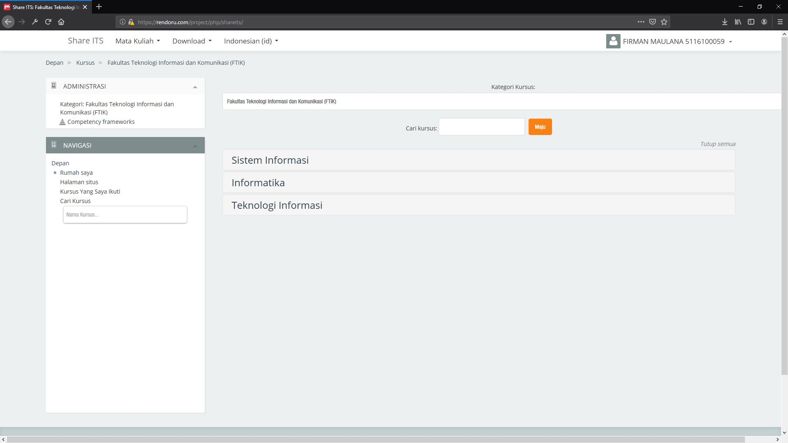
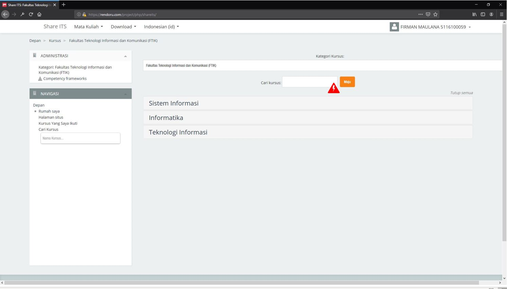
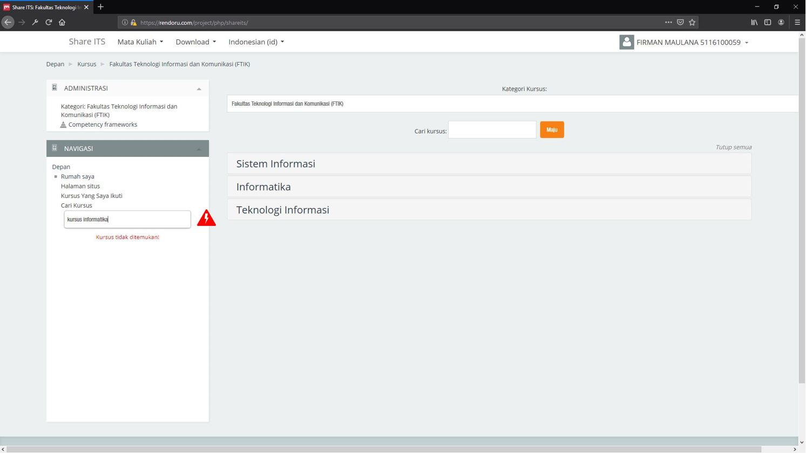
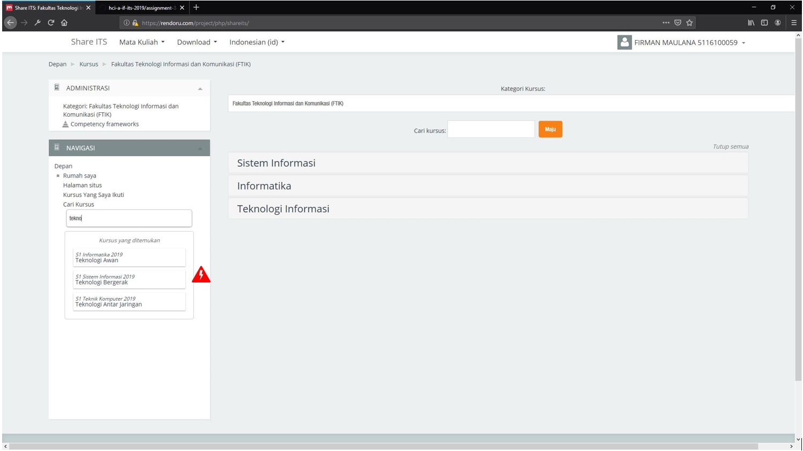
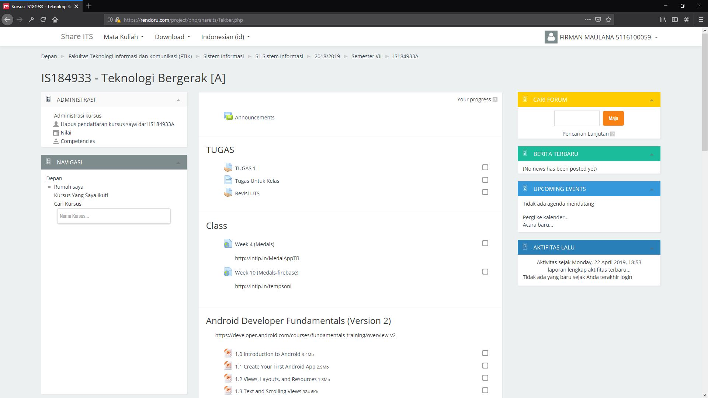

# Assignment - 3
- Firman Maulana
- 05111640000059
- Human - Computer Interaction A

# Usability Evaluation and Prototyping

## Description
Share.its.ac.id is one of the e-learning website that ITS provide to their students. Teachers can create courses that students can enroll in this site. This website is also open for public use that other people can use. Despite of being used by public, this website has some problem in it. One of the problem is in their navigation system which is inconsistent.

I proposed a solution to use an automatic search suggestion since the old search system is not particularly useful acording to last contextual inquiry.

## Operating the Prototype

[](https://youtu.be/ehtrV2w9rjI)

Link To Current Tested Prototype : https://rendoru.com/project/php/shareits/
Link To Idel Prototype Flow Video : https://youtu.be/ehtrV2w9rjI

---

## Part A: Usability Evaluation

### 1. Brief Description of Participants 

#### a. Description of Participant 1
- Previous Contextual Inquiry Participant
- 25 Years Old
- Bachelor of Public Health from Unair University
- Already used E-Learning website before
- Active internet user
- Active computer and smartphone (Android) user

#### b. Description of Participant 2
- 51 Years Old
- Rarely uses computer
- Internet user
- Familiar with some smartphone app (Used Youtube and Whatsapp)

### 2. Evaluation Script

#### Questions
- How old are you?
- What is your current occupation?
- Have you used the internet before?
- How frequently You use the internet?
- Have you used computer before?
- How frequently You use computer?
- Have you used E-Learning before?
- Have you used Search Suggestion before?

#### Intructions
- Show some registered courses that belongs to "Informatika"
- Show some registered courses that belonds to "S2"
- Show some registered courses that belongs to "2018"
- Show some registered courses that belongs to "S1 Sistem Informasi"
- Show some registered courses that belongs to "S1 2018"
- Show some registered courses that belongs to "S3"
- Go to "Teknologi Bergerak"'s page

### 3. Transcript
This transcript only contains the **important** part that i ask during the contextual inquiry with the participants.

#### a. Transcript with Participant 1
```
[00:01:27] Me : Jadi disini saya akan menguji coba sistem yang sudah saya rancang. Sistem yang dirancang disini adalah sistem navigasi di Share ITS.
[00:21:21] Me : Disini saya boleh tahu seberapa umur anda?
[00:35:03] Her : Umur 24 tahun.
[00:39:04] Me : Apakah anda aktif menggunakan internet?
[00:43:19] Her : Iya tentu saja.
[00:45:16] Me : Pekerjaan anda saat ini?
[00:48:15] Her : Pegawai puskesmas.
[00:50:07] Me : Pernah enggak mbaknya menggunakan internet?
[00:52:28] Her : Iya pernah dong.
[00:56:09] Me : Seberapa sering mbaknya menggunakan internet?
[00:59:33] Her : Setiap hari.
[01:03:18] Me : Pernah enggak mbaknya menggunakan komputer sebelumnya?
[01:05:01] Her : Pernah dong.
[01:06:17] Me : Seberapa sering mbaknya menggunakan komputer
[01:09:19] Her : Setiap hari, setiap hari saya ada laporan yang dikerjakan.
[01:26:07] Me : Pernah enggak mbaknya menggunakan website E-Learning sebelumnya?
[01:28:27] Her : Sudah pernah.
[01:51:12] Me : Pernah enggak mbaknya menemukan sebuah suggesti otomatis dari pencarian? Misal seperti digoogle ketika mengetik sebagian nanti ada sugestinya dibawahnya.
[02:00:11] Her : Iya.
[02:03:29] Me : Menurut anda seberapa membantu sugesti itu?
[02:05:13] Her : Sangat membantu.
[02:11:02] Me : ** Explain that there will be an instruction that user must try to achieve and remind her that it will be used to test the system and not her**
[02:35:03] Me : Sekarang tunjukkan kepada saya kursus yang termasuk kedalam departemen "Informatika".
[02:41:21] Her : ** Clicked on the placeholder search menu **
[02:45:20] Her : ** Clicked on the side navigation search menu **
[02:50:21] Her : ** Typed "kursus informatika" and sees the "Kursus tidak ditemukan" and deleted every character and start writing "informatika" **
[03:04:00] Her : ** Typed "informatika", Shown me the result **
[03:13:29] Me : Sekarang bisa tunjukkan kursus - kursus yang termasuk S2?
[03:20:28] Her : Apa harus informatika?
[03:22:01] Me : Enggak harus informatika, hanya harus S2.
[03:24:24] Her : ** Typed "s2", Shown me the result **
[03:32:22] Me : Sekarang bisa tunjukkan kursus - kursus yang ada pada tahun 2018?
[03:40:21] Her : ** Typed "2018", Shown me the result **
[03:52:14] Me : Sekarang bisa tunjukkan kursus yang dia itu termasuk S1 dan tergolong Sistem Informasi?
[04:02:09] Her : ** Typed "s1 sistem informasi", Shown me the result **
[04:10:15] Me : Sekarang bisa tunjukkan kursus - kursus yang tergolong S1 dan pada tahun 2018?
[04:17:21] Her : ** Typed "s1 2018", Shown me the result **
[04:24:09] Me : Sekarang tunjukkan kursus yang ada di S3.
[04:30:05] Her : ** Typed "s3", Shown me the result **
[04:49:15] Me : Bisakah anda menunjukkan kursus Teknologi Bergerak?
[05:01:21] Her : ** Typed "teknologi bergerak", and clicked it **
[05:03:23] Her : ** Website loaded **
```

#### b. Transcript with Participant 2
```
[00:01:27] Me : Selamat siang.
[00:03:13] Her : Siang.
[00:04:42] Me : Disini saya akan melakukan uji coba terhadap sistem yang Saya desain. Namun sebelum kita mulai, saya membutuhkan beberapa info dari anda terlebih dahulu.
[00:19:16] Me : Yang pertama, seberapa lama umur anda?
[00:23:19] Her : 51 tahun.
[00:27:24] Me : Pekerjaan anda saat ini itu apa?
[00:29:43] Her : Ibu rumah tangga.
[00:33:19] Me : Pernahkah anda menggunakan internet?
[00:36:08] Her : Jarang, kadang - kadang.
[00:45:20] Me : Kalau pakai internet itu biasanya dibuat apa?
[00:47:22] Her : Buka youtube sama WA aja.
[00:51:07] Me : Apakah anda pernah menggunakan komputer?
[00:53:17] Her : Kadang - kadang, jarang sekali.
[00:56:20] Me : Pernah membuka website E-Learning enggak? Buat belajar sesuatu?
[01:03:21] Her : Tidak.
[01:08:28] Me : Pernah menggunakan suggesti pencarian seperti di google?
[01:15:02] Her : Tidak tahu, sepertinya iya.
[01:18:20] Me : ** Explain that there will be an instruction that user must try to achieve and remind her that it will be used to test the system and not her**
[01:31:29] Me : Tolong tunjukkan kursus yang berada di informatika
[01:33:18] Her : ** Seems confused about where to start **
[01:50:36] Me : ** Explain that user can use the navigation bar in the left side of the page **
[02:10:18] Her : ** Moves mouse around **
[02:39:12] Her : ** Cursor changed the icon **. Yang ini ta?
[02:47:21] Me : Iya.
[02:52:11] Her : Kursus apa tadi?
[02:54:43] Me : Informatika.
[02:12:32] Her : ** Started typing informatika **
[03:31:53] Her : Yang ini ta ?
[03:34:14] Me : Iya. Sekarang bisa tunjukkan kursus yang S2 ada apa saja?
[03:46:14] Her : Yang informatika? Di cari kursus?
[03:51:27] Me : Yang S2 saja, tidak harus informatika.
[04:50:29] Her : ** typed "s2", Finally shown the result **
[05:11:15] Me : Sekarang bisa menunjukkan kursus yang berada pada tahun 2018?
[05:44:17] Her : **typed "2018", Show the result **
[05:56:29] Me : Sekarang kita cari yang berada program studi Sistem Informasi pada jenjang studi S1.
[06:22:24] Her : Apa tadi?
[06:24:11] Me : S1 Sistem Informasi.
[06:32:23] Her : ** User typed "s1 sisty" and sees "Kursus tidak ditemukan" and start deleting until the suggestion system shown result again **
[06:41:04] Her : ** typed "s1 sistem informasi", Shown me the result **
[06:45:04] Me : Sekarang bisa tunjukkan S1 yang berada pada tahun 2018?
[07:01:28] Her : ** User typed "s1 218" and sees "Kursus tidak ditemukan" and start deleting until the suggestion system shown result again **
[07:06:26] Her : ** typed "s1 2018", Shown me the result **
[07:10:19] Me : Lanjut lagi yang S3 ?
[07:41:11] Her : ** typed "s3", Shown me the result **
[07:46:03] Me : Sekarang cari kursus yang bernama "Teknologi Bergerak".
[08:25:29] Her : ** Typed "teknologi" and clicked "Teknologi Bergerak" **
[08:27:01] Her : ** Website loaded **
```

### 4. Feedback and Incidence Analysis
Every breakdown will be indicated by a red lighting bolt mark.

#### OBSERVATION 1


 - **Reference**: Participant 1 [02:41:21]
 - **Feedback**: Negative Feedback.
 - **Incidence**: Participant tries to use the old "placeholder" search field in the center.
 - **Reason**: She sees it as valid search field.
 - **Resolution**: Remove that search field.
 
#### OBSERVATION 2


 - **Reference**: Participant 1 [02:41:21], Participant 2 [06:32:23], Participant 2 [07:01:28]
 - **Feedback**: Positive Feedback.
 - **Incidence**: Participant didn't get any result when finished writing.
 - **Reason**: The keyword didn't match any available course list.
 - **Resolution**: -
 
#### OBSERVATION 3


 - **Reference**: Participant 2 [08:25:29]
 - **Feedback**: Positive Feedback.
 - **Incidence**: Participant didn't write the full course's name
 - **Reason**: The keyword match partially with the course list
 - **Resolution**: -
 
 #### OBSERVATION 3


 - **Reference**: Participant 1 [05:03:23], Participant 2 [08:27:01]
 - **Feedback**: None
 - **Incidence**: -
 - **Reason**: -
 - **Resolution**: -

 ---

## Part B: Prototyping (again)
> Next, you will need to modify your prototype 
> based on the resolutions you have suggested in `Feedback and Incidence Analysis`'s observations.

### Sketch
> Draw a sketch of your prototype that is refined based according to the aforementioned observations on a paper.
> Afterwards, scan the sketch or make the photograph of it and attach it on this report's section.
> Please make sure the any texts on the sketch are readable.


### Design Rationale
> Please write a paragraph expressing what you have learned from the usability evaluation, 
> and how it is reflected in your design.

### High-Fidelity Interactive-Prototype
> Create a high-fidelity interactive-prototype based on the `Sketch` you have drawn.
> You can use any prototyping tools: InVision, Adobe XD, or even Microsoft PowerPoint.
